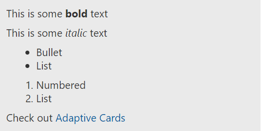

# Text features

[TextBlock](https://adaptivecards.io/explorer/TextBlock.html) offers advanced features for formatting and localizing the text.

## Markdown (Commonmark subset)

To support inline markup, Adaptive Cards support a **subset** of the [Commonmark](https://commonmark.org/help/) Markdown syntax.

> [!NOTE]
>
> [RichTextBlock](https://adaptivecards.io/explorer/RichTextBlock.html) does not support markdown, but offers a wide array of text configuration options directly within the the [TextRun](https://adaptivecards.io/explorer/TextRun.html)

_Supported_

| Text Style      | Markdown |
|-----------------|-----|
| **Bold**        | ```**Bold**``` |
| _Italic_        | ```_Italic_``` |
| Bullet list     | ```- Item 1\r- Item 2\r- Item 3``` | 
| Numbered list   | ```1. Green\r2. Orange\r3. Blue``` |
| Hyperlinks      | ```[Title](url)``` |

_Not supported_

* Headers
* Tables
* Images
* Anything not in the table above

### Markdown Example

The below payload would render something like this:



```json
{
    "$schema": "http://adaptivecards.io/schemas/adaptive-card.json",
    "type": "AdaptiveCard",
    "version": "1.0",
    "body": [
        {
            "type": "TextBlock",
            "text": "This is some **bold** text"
        },
        {
            "type": "TextBlock",
            "text": "This is some _italic_ text"
        },
        {
            "type": "TextBlock",
            "text": "- Bullet \r- List \r",
            "wrap": true
        },
        {
            "type": "TextBlock",
            "text": "1. Numbered\r2. List\r",
            "wrap": true
        },
        {
            "type": "TextBlock",
            "text": "Check out [Adaptive Cards](https://adaptivecards.io)"
        }
    ]
}
```

## Date/Time formatting and localization

Sometimes you won't know the timezone of the user receiving the card, so Adaptive Cards offers `DATE()` and `TIME()` formatting functions to automatically localize the time on the target device.

### Date/Time Example

```json
{
    "$schema": "http://adaptivecards.io/schemas/adaptive-card.json",
    "type": "AdaptiveCard",
    "version": "1.0",
    "body": [
        {
            "type": "TextBlock",
            "text": "Your package will arrive on {{DATE(2017-02-14T06:00:00Z, SHORT)}} at {{TIME(2017-02-14T06:00:00Z)}}",
            "wrap": true
        }
    ]
}
```

The above card will display: 

> **Your package will arrive on Tue, Feb 14th, 2017 at 6:00 AM**

### Date/Time function rules

There are some rules to properly interpret the the date/time functions on every platform. If the rules aren't met then the raw string will be displayed to the user, and no one wants that.

1. **CASE SENSITIVE** (must be all caps)
1. **NO SPACES** between the `{{`, `}}`, or parentheses
1. **STRICT [RFC 3389](https://tools.ietf.org/html/rfc3339) FORMATTING** (See examples below)
1. **MUST BE** a valid date and time

### Valid formats

* `2017-02-14T06:08:00Z`
* `2017-02-14T06:08:00-07:00`
* `2017-02-14T06:08:00+07:00`

### Date formatting param

For dates, an optional param may be specified to format the output.


|       Format        |            Example            |
|---------------------|-------------------------------|
| `COMPACT` (Default) |          "2/13/2017"          |
|       `SHORT`       |     "Mon, Feb 13th, 2017"     |
|       `LONG`        | "Monday, February 13th, 2017" |

