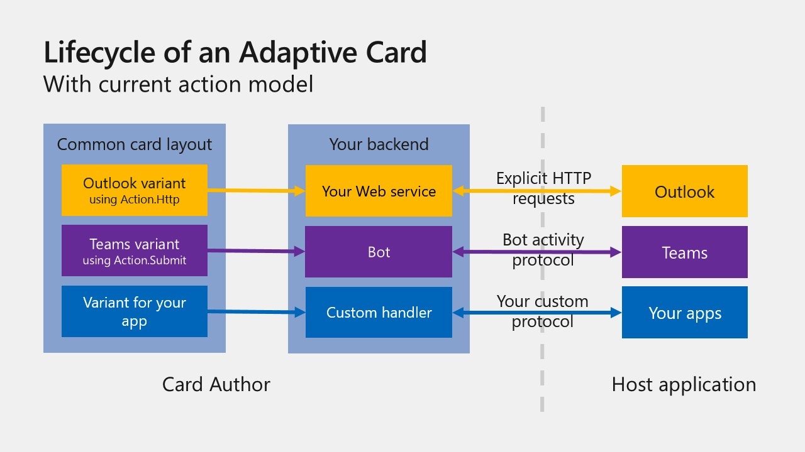
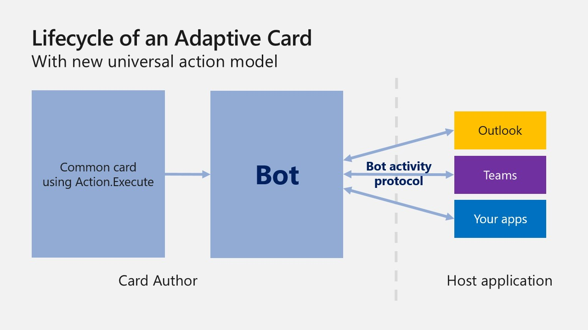
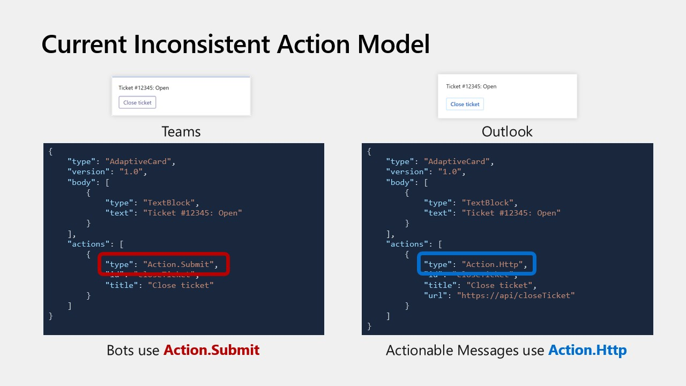
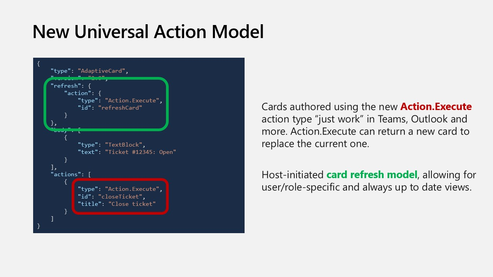

# Universal Action Model

## Context

Adaptive Cards are platform-agnostic snippets of UI, authored using a lightweight JSON format, that apps and services can share. Adaptive Cards not only adapt to the look-and-feel of the host, but also provide rich interaction capabilities. For more information about Adaptive Cards, please visit [adaptivecards.io](http://adaptivecards.io). 

As Adaptive Cards grew in popularity, different hosts started supporting different action models and this led to fragmentation. To solve this problem, the Teams, Outlook and Adaptive Cards teams worked on creating a new universal Bot action model compatible across hosts. This effort led to the following:
- The generalization of Bots and the Bot Framework as the way to implement Adaptive Card-based scenarios for both Teams (Bots) and Outlook (Actionable Message)
- `Action.Execute` as a replacement for both `Action.Submit` (currently used by Bots) and `Action.Http` (currently used by Actionable Messages)
- Popular features only supported by Actionable Messages made available to Bots, namely:
  - The ability for a card to be refreshed at the time it is displayed
  - The ability for `Action.Execute` actions to return an updated card to be immediately displayed in the client

For more information about Actionable Messages in Outlook, please refer to the [Actionable Message documentation](/outlook/actionable-messages/send-via-email)

For details on various scenarios possible with Universal Actions in Teams, please refer to [Teams cards reference](/microsoftteams/platform/task-modules-and-cards/cards/universal-actions-for-adaptive-cards/overview).

Before `Action.Execute` |  With `Action.Execute`
:-------------------------:|:-------------------------:
 | 
 | 

Source: [Adaptive Cards @ Microsoft Build 2020](https://youtu.be/hEBhwB72Qn4?t=1393)

The rest of this document focuses on documenting the universal Bot action model in the context of Teams & Outlook. If you are already using Adaptive cards on Teams with Bot, you can use the same Bot with a few changes to support `Action.Execute`. If you are using Actionable Messages on Outlook, you will need to develop a Bot that supports `Action.Execute`. Currently the support on Outlook clients for Universal Bot action model is under active development.

## Schema

> ### IMPORTANT
>
> The universal Bot action model is introduced in the **Adaptive Cards schema version 1.4**. In order to use these new capabilities, the `version` property of your Adaptive Card must be set to **1.4** or greater, as shown in the below examples. Note that this will make your Adaptive Card incompatible with older clients (Outlook or Teams) that do not support the universal Bot action model.
>
> If you use the `refresh` property and/or `Action.Execute` and specify a card version < 1.4, the following will happen:
>
> | Client | Behavior |
> | --- | --- |
> | Outlook | Your card **WILL NOT** work. `refresh` will not be honored and `Action.Execute` will not render. Your card may even be rejected entirely. |
> | Teams | Your card **MAY NOT** work (the `refresh` may not be honored, and the `Action.Execute` actions may not render) depending on the version of the Teams client.<br><br> To ensure maximum compatibility in Teams, consider defining your `Action.Execute` actions with an `Action.Submit` action in the `fallback` property. |
>
> Refer to the **Backward compatibility** section below for more information.


### Action.Execute

When authoring Adaptive Cards, use `Action.Execute` in place of both `Action.Submit` &  `Action.Http`. The schema for `Action.Execute` is quite similar to that of `Action.Submit`.

**Example JSON**
```json
{
  "$schema": "http://adaptivecards.io/schemas/adaptive-card.json",
  "type": "AdaptiveCard",
  "version": "1.4",
  "body": [
    {
      "type": "TextBlock",
      "text": "Present a form and submit it back to the originator"
    },
    {
      "type": "Input.Text",
      "id": "firstName",
      "placeholder": "What is your first name?"
    },
    {
      "type": "Input.Text",
      "id": "lastName",
      "placeholder": "What is your last name?"
    },
    {
      "type": "ActionSet",
      "actions": [
        {
          "type": "Action.Execute",
          "title": "Submit",
          "verb": "personalDetailsFormSubmit",
          "fallback": "Action.Submit"
        }
      ]
    }
  ]
}
```

**Properties**

| Property | Type | Required | Description 
| -------- | ---- | -------- | ----------- 
| **type** | `"Action.Execute"` | Yes | Must be `"Action.Execute"`. |
| **verb** | string | No | A convenience string that can be used by developer to identify the action |
| **data** | `string`, `object` | No | Initial data that input fields will be combined with. These are essentially ‘hidden’ properties. |
| **title** | `string` | No | Label for button or link that represents this action. |
| **iconUrl** | `uri` | No | Optional icon to be shown on the action in conjunction with the title. Supports data URI in Adaptive Cards version 1.2+ |
| **style** | `ActionStyle` | No | Controls the style of an Action, which influences how the action is displayed, spoken, etc. |
| **fallback** | `<action object>`, `"drop"` | No | Describes what to do when Action.Execute is unsupported by the client displaying the card. |
| **requires** | `Dictionary<string>` | No | A series of key/value pairs indicating features that the item requires with corresponding minimum version. When a feature is missing or of insufficient version, fallback is triggered. |


### Refresh mechanism

Alongside `Action.Execute`, a new refresh mechanism is now supported, making it possible to create Adaptive Cards that automatically update at the time they are displayed. This ensures that users always see up to date data. A typical refresh use case is an approval request: once approved, it is best that users are not presented with a card prompting them to approve when it's already been done, but instead provides information on the time the request was approved and by whom.

To allow an Adaptive Card to automatically refresh, define its `refresh` property, which embeds an `action` of type `Action.Execute` as well as a `userIds` array.

| Property | Type | Required | Description 
| -------- | ---- | -------- | ----------- 
| **action** | `"Action.Execute"` | Yes | Must be an action instance of type `"Action.Execute"`. |
| **userIds** | `Array<string>` | Yes | An array of `MRI`s of users for whom Auto Refresh must be enabled.<br><br>**IMPORTANT:** If the `userIds` list property isn't included in the `refresh` section of the card, the card will NOT automatically refresh on display. Instead, a button will be presented to the user to allow them to manually refresh. The reason for this is chats/channels in Teams can include a large number of members; if many members are all viewing the channel at the same time, an unconditional automatic refresh would result in many concurrent calls to the bot, which would not scale. To alleviate the potential scale problem, the `userIds` property should always be included to identify which users should get an automatic refresh, with a maximum of **60** user IDs currently being allowed.  See [userIds in refresh](/microsoftteams/platform/task-modules-and-cards/cards/universal-actions-for-adaptive-cards/work-with-universal-actions-for-adaptive-cards#user-ids-in-refresh) for more details.<br><br>Note that the `userIds` property is ignored in Outlook, and the `refresh` property is always automatically honored. There is no scale issue in Outlook because users will typically view the card at different times.|

**Sample JSON**
```JSON
{
  "$schema": "http://adaptivecards.io/schemas/adaptive-card.json",
  "type": "AdaptiveCard",
  "originator":"c9b4352b-a76b-43b9-88ff-80edddaa243b",
  "version": "1.4",
  "refresh": {
    "action": {
      "type": "Action.Execute",
      "title": "Submit",
      "verb": "personalDetailsCardRefresh"
    },
    "userIds": []
  },
  "body": [
    {
      "type": "TextBlock",
      "text": "Present a form and submit it back to the originator"
    },
    {
      "type": "Input.Text",
      "id": "firstName",
      "placeholder": "What is your first name?"
    },
    {
      "type": "Input.Text",
      "id": "lastName",
      "placeholder": "What is your last name?"
    },
    { 
      "type": "ActionSet",
      "actions": [
        {
          "type": "Action.Execute",
          "title": "Submit",
          "verb": "personalDetailsFormSubmit",
          "fallback": "Action.Submit"
        }
      ]
    }
  ]
}
```

#### Important note for Outlook Actionable Message developers

When developing Outlook Actionable Message scenarios, the Adaptive Card's `originator` property must be specified. `originator` is a Globally Unique Identified (GUID) generated at the time a Bot subscribes to the Outlook channel. It is used by Outlook to validate that the Adaptive Card was sent by an authorized Bot. The Adaptive Card will not be rendered in Outlook if `originator` is absent. `originator` is ignored in Teams.

### `adaptiveCard/action` Invoke activity

When an `Action.Execute` is executed in the client (whether it's the refresh action or an action explicitly taken by a user by clicking a button), a new type of Invoke activity - `adaptiveCard/action` - is made to your Bot. A typical `adaptiveCard/action` Invoke activity request will look like the following:

#### Request format

```json
{ 
  "type": "invoke",
  "name": "adaptiveCard/action",

  // ... other properties omitted for brevity

  "value": { 
    "action": { 
      "type": "Action.Execute", 
      "id": "abc", 
      "verb": "def",
      "data": { ... } 
    },
    "trigger": "automatic | manual" 
  }
} 
```

| Field | Description |
| -------- | ----------- |
| **value.action** | A copy of the action as defined in the Adaptive Card. Like with `Action.Submit`, the `data` property of the action includes the values of the various inputs in the card, if there are any |
| **value.trigger** | Indicates if the action was triggered explicitly (by the user clicking a button) or implicitly (via automatic refresh) |

#### Response format

If the Bot did process an incoming `adaptiveCard/action` Invoke activity (i.e. if the Bot's code was involved at all in processing the request), the HTTP response's status code returned by the Bot must be equal to 200 and the body of the HTTP response must be formatted as follows:

```JSON
{ 
    "statusCode": <number (200 – 599)>, 
    "type": "<string>", 
    "value": "<object>"
} 
```

| Field | Description |
| -------- | ----------- |
| **statusCode** | An HTTP response status code of 200 does NOT necessarily mean the Bot was able to _successfully_ process the request. A client application MUST always look at the `statucCode` property in the response's body to know how the Bot processed the request. `statusCode` is a number ranging from 200-599 that mirrors HTTP status code values and is meant to be a sub-status for the result of the bot processing the Invoke. A missing, null, or undefined value for `statusCode` implies a 200 (Success). |
| **type** | A set of well-known string constants that describe the expected shape of the value property  |
| **value** | An object that is specific to the type of response body  |

**Supported status codes**

The following table lists the allowed values for `statusCode`, `type`, and `value` in the Bot's response body:

| Status Code | Type | Value Schema | Notes |
| --- | --- | --- | --- |
| 200 | `application/vnd.microsoft.card.adaptive` | `Adaptive Card` | The request was successfully processed, and the response includes an Adaptive Card that the client should display in place of the current one. |
| 200 | `application/vnd.microsoft.activity.message` | `string` | The request was successfully processed, and the response includes a message that the client should display. |
| 400 | `application/vnd.microsoft.error` | Error Object (TODO: needs link) | The incoming request was invalid. | 
| 401 | `application/vnd.microsoft.activity.loginRequest` | OAuthCard (TODO: needs link) | The client needs to prompt the user to authenticate. |
| 401 | `application/vnd.microsoft.error.inccorectAuthCode` | null | The authentication state passed by the client was incorrect and authentication failed. |
| 412 | `application/vnd.microsoft.error.preconditionFailed` | Error Object (TODO: needs link) | The SSO authentication flow failed. |
| 500 | `application/vnd.microsoft.error` | Error Object (TODO: needs link) | An unexpected error occurred. |

## Summary: how to leverage the universal Bot action model

1. Use `Action.Execute` instead of `Action.Submit`. To update an existing scenario on teams, replace all instances of `Action.Submit` with `Action.Execute`. For upgrading an existing scenario on Outlook please refer to the backward compatibility section below.
2. For cards to surface on outlook add the `originator` field. Refer the Sample JSON above.  
3. Add a `refresh` clause to your Adaptive Card if you want to leverage the automatic refresh mechanism or if your scenario requires user specific views. Be sure to specify the `userIds` property to identify which users (maximum 60) will get automatic updates. 
4. Handle `adaptiveCard/action` Invoke requests in your Bot
5. Whenever your Bot needs to return a new card as a result of processing an `Action.Execute`, you can use the Invoke request's context to generate cards that are specifically crafted for a given user. Make sure the response conforms to the response schema defined above.

## Backward compatibility

### Outlook

The new `Action.Execute` universal action model is a departure from the `Action.Http` action model currently used by Outlook Actionable Messages, where actions are encoded in the Adaptive Card as explicit HTTP calls. The `Action.Execute` model makes it possible for developers to implement scenarios that "just work" in both Outlook and Teams. Actionable Message scenarios can either use the `Action.Http` model or the new `Action.Execute` model, but not both. Scenarios that use the universal `Action.Execute` model must be implemented as Bots and subscribe to `Outlook Actionable Messages` channel.

> #### Important notes
> - Scenarios implemented using the universal `Action.Execute` model will not be compatible with older versions of Outlook
> - Work is in progress to allow existing Actionable Message scenarios to seamlessly migrate to the universal `Action.Execute` model

### Teams

In order for your cards to be backward compatible and work for users on older versions of Teams, your `Action.Execute` actions should include a `fallback` property defined as an `Action.Submit`. Your Bot should be coded in such a way that it can process both `Action.Execute` and `Action.Submit`. Note that it is not possible for your Bot to return a new card when processing an `Action.Submit`, so fallback behavior via `Action.Submit` will provide a degraded experience for the end user.

> #### Important note
> Some older Teams clients do not support fallback property when not wrapped in an `ActionSet`. In order to not break on such clients, it is **strongly recommended** that you wrap _all_ your `Action.Execute` in `ActionSet`. See example below on how to wrap `Action.Execute` in `ActionSet`.

In the below example, note the `version` property of the card is set to `1.2` and the `Action.Execute` is defined with an `Action.Submit` as its `fallback`. When rendered in a Teams client that supports Adaptive Cards 1.4, the `Action.Execute` will render and work as expected. In Teams clients that do not support Adaptive Cards 1.4, the `Action.Submit` will be rendered in place of the `Action.Execute`.

```JSON
{
  "$schema": "http://adaptivecards.io/schemas/adaptive-card.json",
  "type": "AdaptiveCard",
  "version": "1.2",
  "body": [
    {
      "type": "TextBlock",
      "text": "Present a form and submit it back to the originator"
    },
    {
      "type": "Input.Text",
      "id": "firstName",
      "placeholder": "What is your first name?"
    },
    {
      "type": "Input.Text",
      "id": "lastName",
      "placeholder": "What is your last name?"
    },
    {
      "type": "ActionSet",
      "actions": [
        {
          "type": "Action.Execute",
          "title": "Submit",
          "verb": "personalDetailsFormSubmit",
          "fallback": {
            "type": "Action.Submit",
            "title": "Submit"
          }  
        }
      ]
    }
  ]
}
```

## References
- [Universal Action Model Teams Documentation](/microsoftteams/platform/task-modules-and-cards/cards/universal-actions-for-adaptive-cards/overview)
- [Adaptive Cards @ Microsoft Build 2020](https://youtu.be/hEBhwB72Qn4?t=1393)
- [Adaptive Cards @ Ignite 2020](https://techcommunity.microsoft.com/t5/video-hub/elevate-user-experiences-with-teams-and-adaptive-cards/m-p/1689460)
