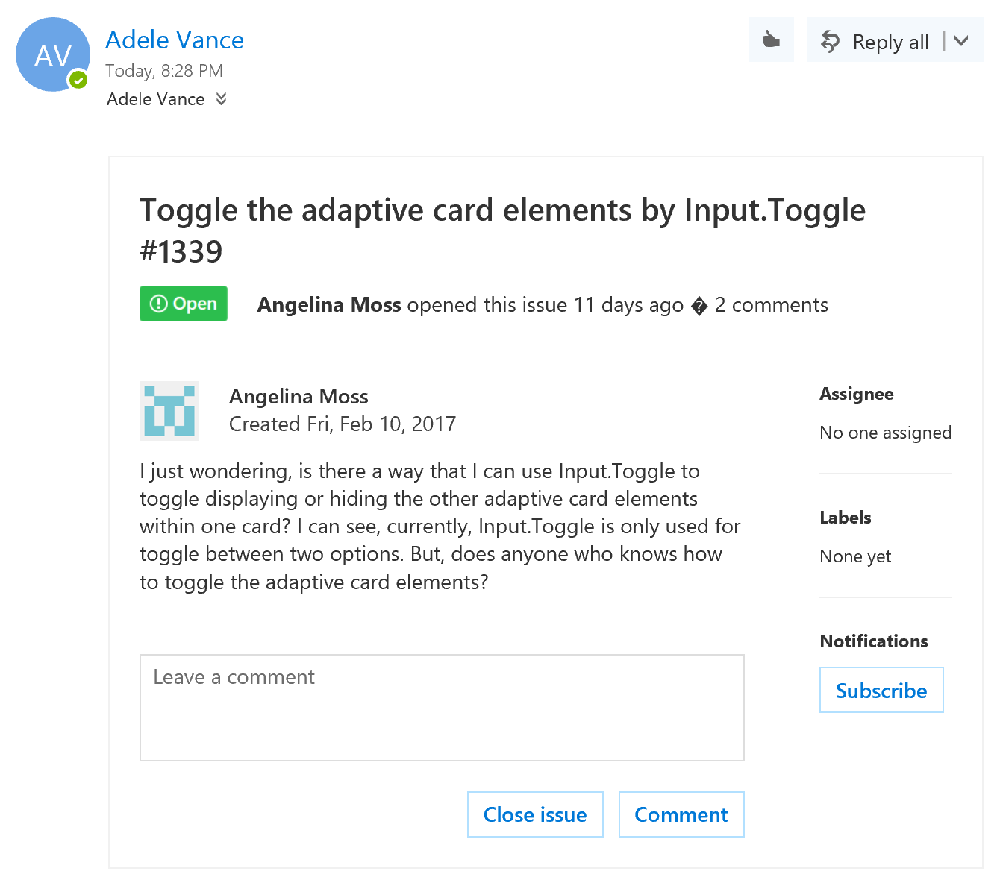

# Adaptive Cards for Outlook Actionable Message Developers

Whether you are filling out a survey, approving an expense report, or updating a CRM sales opportunity, Actionable Messages enable you to take quick actions right from within Outlook. Developers can now embed Adaptive Cards in their emails or notifications, elevating user engagement with their services and increasing organizational productivity.

You can now use Adaptive Cards to power your Outlook Actionable Messages, and create rich experiences like the one showcased at the Build 2018 conference:

## GitHub

## Limeade

## Ready to start?

- Head over to https://docs.microsoft.com/outlook/actionable-messages/ which will guide you through the steps of creating your first Actionable Message scenario.
- Use the Actionable Message Card Playground tool to see card samples, create your own cards, send them to your own Office 365 account and see them in [Outlook for the Web](https://outlook.office.com).
- Would you rather not write JSON manually? The [Adaptive Card Designer (preview)](https://acdesignerbeta.azurewebsites.net) lets you create Adaptive Cards without writing a single line of JSON!