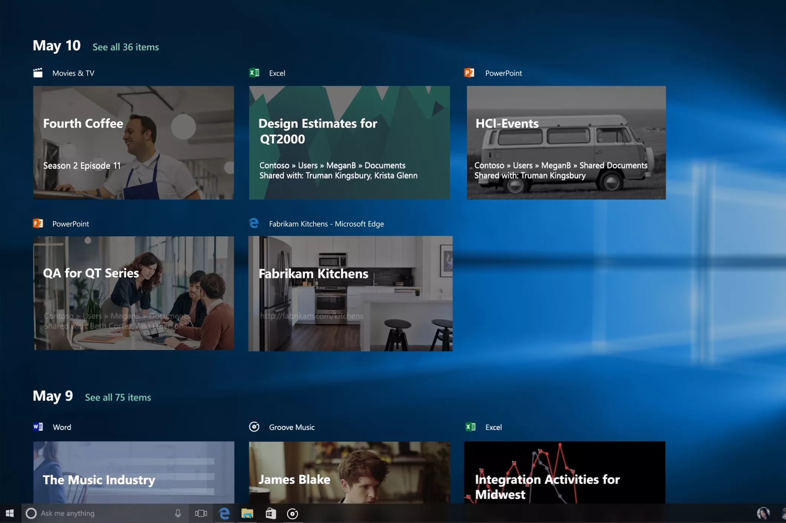

# Adaptive Cards for Windows Developers

## Timeline

The first Windows experience to supports Adaptive Cards is Timeline, a brand new experience first introduced in Windows 10 1803. 



### UserActivity API

The [`Windows.ApplicationModel.UserActivities.UserActivity`](/uwp/api/windows.applicationmodel.useractivities.useractivity) API is what populates an Activity into Timeline.

The Adaptive Card will be supplied via the `Content` property of `VisualElement`, as seen below:

```csharp
UserActivity userActivity = await channel.GetOrCreateUserActivityAsync(activityId, new HostName("contoso.com"));
userActivity.ActivationUri = new Uri("rss-reader:article?" + article.Link);
userActivity.DisplayText = article.Title; //used for details tile text
userActivity.VisualElements.Content = AdaptiveCardBuilder.CreateAdaptiveCardFromJson(jsonString);
await userActivity.SaveAsync();
```

### Learning Module

There is a great 45-min learn module that covers these steps end-to-end.

[Integrate adaptive cards into Windows 10 Timeline](/learn/modules/integrate-app-into-windows-10-timeline/)

### Learn more

This session at Build 2017 covers User Activities in detail.

<iframe src="https://channel9.msdn.com/Events/Build/2017/B8108/player" width="960" height="540" allowFullScreen frameBorder="0"></iframe>

## Other Windows Surfaces
We don't have anything to share just yet, but we're working on incorporating Adaptive Cards into more Windows experiences.

## Dive in!

We've barely scratched the surface in this tutorial, so check back soon and browse the links below to explore more about Adaptive Cards.

* [Browse Sample cards](https://adaptivecards.io/samples/) for inspiration
* Use the [Schema Explorer](https://adaptivecards.io/explorer) to learn the available elements
* Build a card using the [Interactive Visualizer](https://adaptivecards.io/visualizer/index.html?hostApp=Skype)
* [Get in touch](https://adaptivecards.io/connect) with any feedback you have
