# Adaptive Card Renderer Specification

The following specification describes how implement an Adaptive Card renderer on any native UI platform.

> [!IMPORTANT]
> 
> This content is a work in progress and may be missing some details. Please [let us know](https://github.com/Microsoft/AdaptiveCards/issues) if you have any questions or feedback.

## Parsing JSON

### Error conditions
1. A parser **MUST** check that it's valid JSON content
1. A parser **MUST** validate against the schema (required properties, etc)
1. The above errors **MUST** be reported to the host app (exception or equivalent)

### Unknown types
1. If unknown "types" are encountered they **MUST BE DROPPED** from the result
1. Any alterations of the payload (like above) **SHOULD** be reported as warnings to the host app

### Unknown properties
1. A parser **MUST** include **additional** properties on elements

### Additional considerations
1. The `speak` property **MAY** contain SSML markup and **MUST** be returned to the host app as-specified

## Parsing Host Config
1. TODO

## Versioning

1. A renderer **MUST** implement a particular version of the schema. 
1. The `AdaptiveCard` constructor **MUST** give the `version` property a default value based on the current schema version 
1. If a renderer encounters a `version` property in the `AdaptiveCard` that is higher than the supported version, it **MUST** return the `fallbackText` instead.

## Rendering

An `AdaptiveCard` consists of a `body` and `actions`. The `body` is a collection of `CardElement`s that a renderer will enumerate and render in order. 

1. Each Element **MUST** stretch to the width of its parent (think `display: block` in HTML).
1. A renderer **MUST** ignore any unknown element types it encounters and continue rendering the rest of the payload.

### Text, TextBlock and RichTextBlock

1. A TextBlock **MUST** take up a single line unless the `wrap` property is `true`. 
1. The text block **SHOULD** trim any excess text with an ellipsis (...)

##### Markdown

1. Adaptive Cards allow for a subset of Markdown and **SHOULD** be supported in `TextBlock`. 
2. RichTextBlock **DOES NOT** support Markdown, and must be styled using the properties that are exposed.
3. See full [markdown requirements](../authoring-cards/text-features.md)

##### Formatting functions

1. `TextBlock` allows [DATE/TIME formatting functions](../authoring-cards/text-features.md) that **MUST** be supported on every renderer.
1. **ALL FAILURES MUST** display the raw string in the card. No friendly message attempted. (The goal being to make the developer immediately aware there is a problem)

### Images

1. A renderer **SHOULD** allow host apps to know when all HTTP images have been downloaded and the card is "fully rendered"
1. A renderer **MUST** inspect the Host Config `maxImageSize` param when downloading HTTP images
1. A renderer **MUST** support `.png` and `.jpeg`
1. A renderer **SHOULD** support `.gif` images

### Advanced Layout Behavior 

The Renderer **MUST** take care to the following behaviors when rendering card elements with respect to the attributes mentioned in this doc. 

The renderer should manage **Constraints** taking into account the various factors such as margin, padding, height and width etc configuration of the card elements and its children.

### Width 

1. Allowed values - `auto`, `stretch` and fixed values in terms of `pixels` and `weight`
2. `auto` provides sufficient space for expansion of width (supports min expansion)
3. `stretch` takes up the remaining width (supports max expansion)

Below below scenarios describes how the constraints are affected with different width combinations for columns

#### `auto` vs `stretch`
1. Columns with `auto` and `stretch` width.

* The first column with `auto` width takes sufficient space to display the content and the second column with `stretch` width takes up the entire space.

2. Columns with only `stretch` width

* Columns with only stretch width takes up the remaining spaces after dividing it equally.

3. `auto`,`stretch` and `auto` 

The **first** and **third** columns width is adjusted first to accommodate the elements sufficiently and the **second** column with stretched width takes up the remaining space. 

4. Order of displaying elements with `auto` width columns

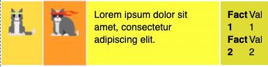

* Columns with `auto` will position themselves to provide ample space for the content to render. 
* In case of **Image views**, images will downscale to fit the remaining width. 
* **Note:** Images will downscale only for `stretch` and `auto` image size, but not for fixed width and height in pixels.    

#### `weights` vs `pixels`

1. Columns with `weight` and `pixel` width combination

* The above card has three columns with the following width configuration - 
* `Column1: Weight 50`, `Column2: 100px`, `Column3: Weight 50`
* The width of Column 2 is determined by the `pixel value`
* The width of Column 1 and 3 is adjusted based on the `weights` and the calculated `weight ratio`.

2. Columns with `weight`, `pixel width` and `auto` attributes

* The above card has four columns with the following width configuration - 
* `Column1: Weight 50`, `Column2: 100px`, `Column3: Weight 50`, and `Column4: auto`
* **Note:** Image view with `auto` width column downscales to adjust to the remaining space. 

### Precedence order of displaying elements with the width attribute
`px` > `weight` > `auto` > `stretch`

### Height 

 Allowed values - `auto` and `stretch` 

Below  scenarios describes how the constraints are affected with different height combinations for card elements

1. Elements expand freely vertically when card is not of fixed height

* Both the columns can expand sufficiently vertically irrespective of `auto` and `stretch` values
* This is with the `wrap` property disabled for the text block.

2. The card below has the `wrap` property enabled for the text block. 

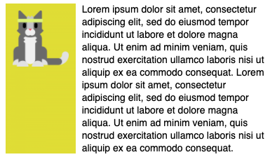

### Spacing and Separator

1. The `spacing` property on every element influences the amount of space between the **CURRENT** element and the one **BEFORE** it.
1. Spacing **MUST ONLY** apply when there actually is an element preceding it. (E.g., won't apply to the first item in an array)
1. A renderer **MUST** look up the amount of space to use from the `hostConfig` spacing for the enum value applied to the current element.
1. If the element has a `separator` value of `true`, then a visible line **MUST** be drawn between the current element and the one before it.
1. The separator line **MUST** be drawn using the `container.style.default.foregroundColor`.
1. A separator **MUST ONLY** be drawn if the item **IS NOT** the first in the array.
 1. **Spacing** - Allowed values `none`, `small`, `default`, `medium`, `large`, `extra large` and `padding` 

* Spacing attribute adds spacing between this element and the preceding element.

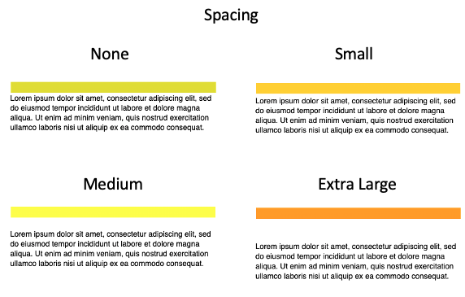

* Spacing attribute does not have any effect when its the first element in the view container. 

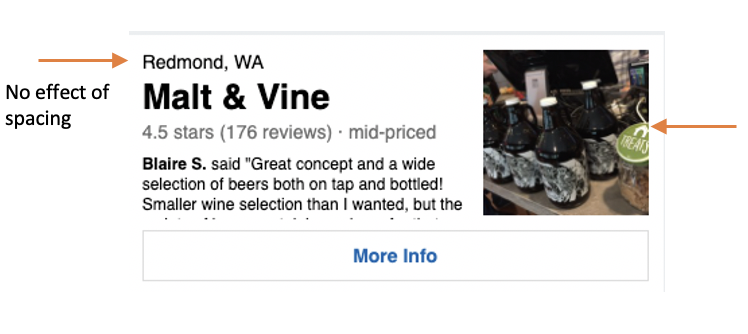

* The elements marked with arrow are the first elements among its siblings, so spacing has no effect. 

 2. **Separator** - Possible values (on/off toggle)

* Draws a seperating line at the top of the element.

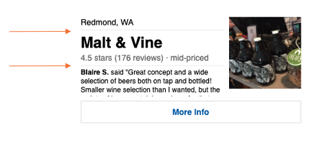

3. **Spacing and Seperator combination**

* The constraints of the spacing and the seperator combination are illustrated below. 

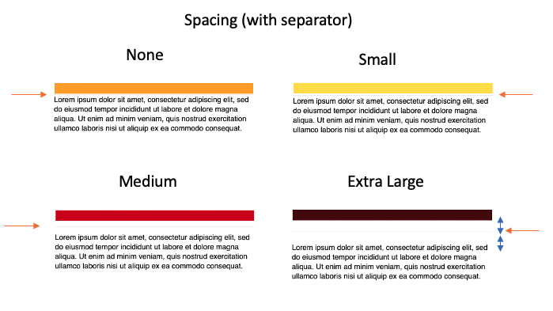

* The overall spacing distance is maintained with respect to the values provided.
* The seperator is added halfway in the middle of the spaced distance.

[Note. Need to confirm the distance where the seperator is inserted in the spacing area. Seems like the middle]

### Container Styles

* Provides styling hints for containers such as columns and columnset
* Allowed values `none`, `default`, `emphasis`, `good`, `attention`, `warning` and `accent`
* These predefined style options provides padding for the elements within the container and background color

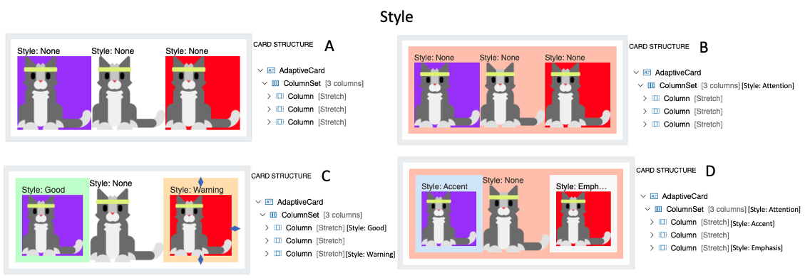

1. Card A illustrates columns and columnset with no style options
2. Card B illustrates columnset with **Attention** style. Notice the padding within the columnset container and the change in background color. 
3. Card C illustrates columns with styling only. Similar to the previous one, column includes padding and background change. 
4. Card D illustrates columns and columnset both with style options.

[Note. Need to check how the padding amount is determined. Is it determined by the host? ]

### Bleed

* This property allows the container such as columns and columnset to bleed through its parent. 
* Possible values `on` and `off`.

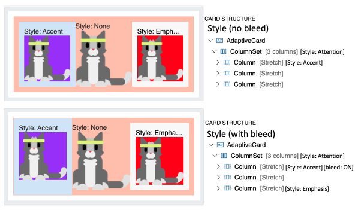

1. Card A illustrates columns and columnset with regular styling.
2. Card B illustrates the first column with bleed option. The content just bleeds through its boundaries to its parent's. 
 
### Image Size

### `Size` attribute
* Allowed values - `auto`, `stretch`, `small`, `medium`, `large`
* `auto` : Images will scale down to fit if needed, but will not scale up to fill the area.
* `stretch` : Image with both scale down and up to fit as needed.
* `small`, `medium` and `large`: Image is displayed with a fixed width, where the width is determined by the host.

1. `auto` vs `stretch`

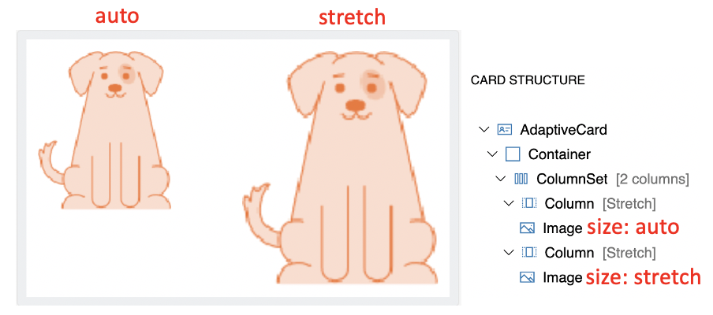

2. Column width and Image Size combination

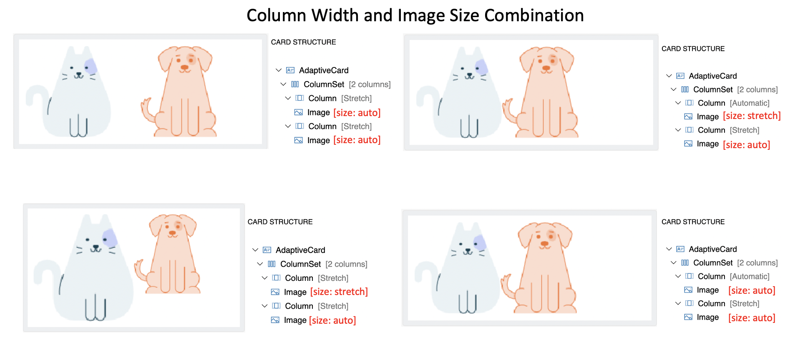

* Generally, Columns with `stretch` width allow images to upscale freely with `stretch` size.
* Columns with `auto` width allows image to occupy exact space irrespective of `auto` and `stretch` size of image.
* Column width takes more precedence in determining the image size in this arrangement.

#### Image `Width (in pixels)` attribute
* This provides the desired on-screen width of the image. 
* `size` property is overriden when a value is specified

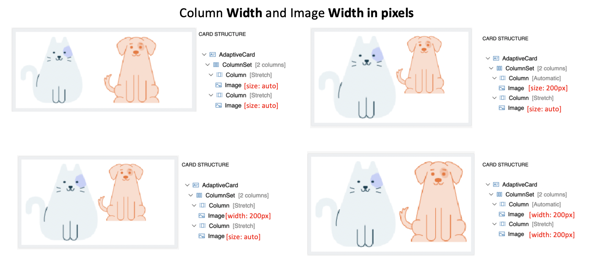
* The column with `auto` width will have more precedence than `stretch` in providing room for image content in this arrangement. 

#### Column Width (weight and pixel) and Image size (auto and stretch) Combination

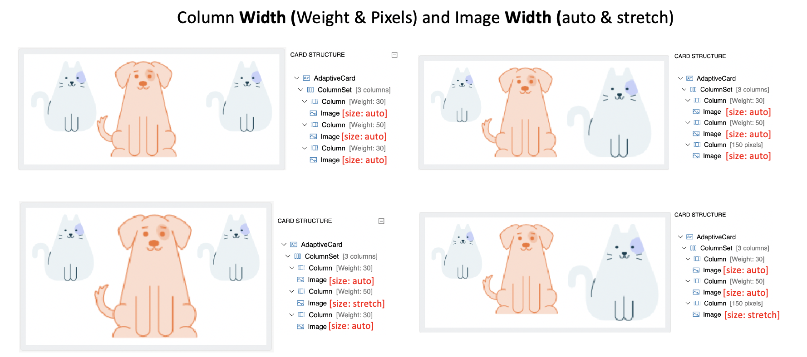
* Images with `auto` size takes sufficient space for expansion (or downscales) within the column constraints of `weight` and `pixel` width. 
* Images with `stretch` size can expand to fill the remaining space within the constraints of column `weight` and `pixel` width. 

### Advanced Layout Summary
* Column width takes more precedence in determining the size of the image than its image size (auto, stretch, min width etc). 
* The precedence of the column width taken to display its content sufficiently - `px` > `weight` > `auto` > `stretch`
* Image `size` (auto, stretch) is **ignored** when Image `width` and `height` in px is provided. 
* Image `stretch` size attribute will upscale the image only when there is remaining space and column auto is **not** `auto`.
* An image stretches itself to the limit where it maintain its aspect ratio in the space available in the column. In turn, the height expands freely.
* `Spacing` attribute will not have any effect when its the first or the only element among its sibling. 

## Actions

1. If HostConfig `supportsInteractivity` is `false`, a renderer **MUST NOT** render any actions.
1. The `actions` property **MUST** be rendered as buttons in some kind of action bar, usually at the bottom of the card. 
1. When a button is tapped it **MUST** allow the host app to handle the event. 
1. The event **MUST** pass along all associated properties with the action
1. The event **MUST** pass along the `AdaptiveCard` which was executed

| Action              | Behavior                                                                                                                                          |
| ------------------- | ------------------------------------------------------------------------------------------------------------------------------------------------- |
| **Action.OpenUrl**  | Open an external URL for viewing                                                                                                                  |
| **Action.ShowCard** | Requests a sub-card to be shown to the user.                                                                                                      |
| **Action.Submit**   | Ask for all of the input elements to be gathered up into an object which is then sent to you through some method defined by the host application. |
| **Action.Execute**   | (Introduced in v1.4) Ask for all of the input elements to be gathered up into an object which is then sent to you through the "universal action pipeline" |

### Action.OpenUrl
1. `Action.OpenUrl` **SHOULD** open a URL using the native platform mechanism
1. If this is not possible it **MUST** raise an event to the host app to handle opening the URL. This event **MUST** allow the host app to override the default behavior. E.g., let them open the URL within their own app.

### Action.ShowCard

1. `Action.ShowCard` **MUST** be supported in some way, based on the hostConfig setting. There are two modes: inline, and popup. Inline cards **SHOULD** toggle the card visibility automatically. In popup mode, an event **SHOULD** be fired to the host app to show the card in some way.

### Action.Submit

* `Action.Submit` element gathers input fields, merges with optional data field, and sends an event to the client.
* A significant difference in the element behavior is present between 1.x and 2.x version of the ACL renderer.

The Submit Action behaves like an HTML form submit, except that where HTML typically triggers an HTTP post, Adaptive Cards leaves it up to each host app to determine what "submit" means to them. 

1. When this **MUST** raise an event the user taps the action invoked.  
1. The `data` property **MUST** be included in the callback payload.
1. For `Action.Submit`, a renderer **MUST** gather all inputs on the card and retrieve their values. 

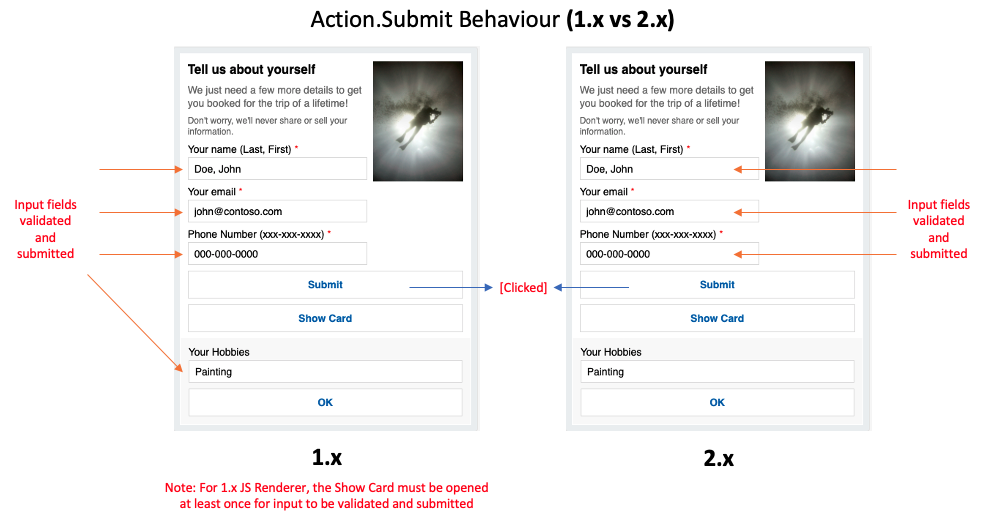

* `1.x Renderer` - The inputs are collected from all fields irrespective of the where in the hierarchy the input field is present. 
* `2.x Renderer` - The inputs are collected from fields present in parent container or as a sibling of the `Action.Submit` element. 

### Action.Execute (Details coming later)

Action.Execute was introduced in version 1.4. We will provide implementation guidance for SDKs at a later date. Please reach out if you have questions on this topic.

### selectAction

1. If Host Config `supportedInteractivity` is `false` then a `selectAction` **MUST NOT** render as a touch target.
1. `Image`, `ColumnSet`, and `Column` offer a `selectAction` property, which **SHOULD** be executed when the user invokes it, e.g., by tapping the element.

## Inputs

1. If HostConfig `supportsInteractivity` is `false` a renderer **MUST NOT** render any inputs.
2. Inputs **SHOULD** render with the highest fidelity possible. For example, an `Input.Date` would ideally offer a date picker to a user, but if this isn't possible on your UI stack, then the renderer **MUST** fall back to rendering a standard text box.
3. A renderer **SHOULD** display the `placeholderText` if possible
5. Input value binding **MUST** be properly escaped
4. Prior to v1.3, A renderer **DOES NOT** have to implement validation of the input. Users of Adaptive Cards must plan to validate any received data on their end.
6. [Input Labels and Validation were introduced](../authoring-cards/input-validation) in v1.3 of the Adaptive Cards Schema. Extra care must be taken to render the associated label, validation hints and error messages.

## Styling, Customization and Extensibility APIs

Each SDK should provide a certain level of flexibilty to Host Apps in order to control the overall styling, and extend the schema as they see fit.

### Host Config

* TODO: What should the defaults be? Should they all share it? Should we embed a common hostConfig.json file in the binaries?

[`HostConfig`](host-config.md) is a shared configuration object that specifies how an Adaptive Card Renderer generates UI.  

This allows properties which are platform agnostic to be shared among renderers on different platforms and devices. It also allows tooling to be created which gives you an idea of the look and feel that card would have for a given environment.

1. Renderers **MUST** expose a **Host Config** parameter to host apps
2. All elements **MUST** be styled according to their respective Host Config settings

### Native platform styling

1. Each element type **SHOULD** attach a native platform style with the generated UI element. E.g., in HTML we added a CSS class to the element types, and in XAML we assign a specific Style.

## Extensibility 

1. A renderer **MUST** allow host apps to override default element renderers. E.g., replace `TextBlock` rendering with their own logic.
1. A renderer **MUST** allow host apps to register custom element types. E.g., add support for a custom `Rating` element
1. A renderer **MUST** allow host apps to remove support for a default element. E.g., remove `Action.Submit` if they don't want it supported.

## Events

1. A renderer **SHOULD** fire an event when an element's visibility has changed, allowing the host app to scroll the card into position.
