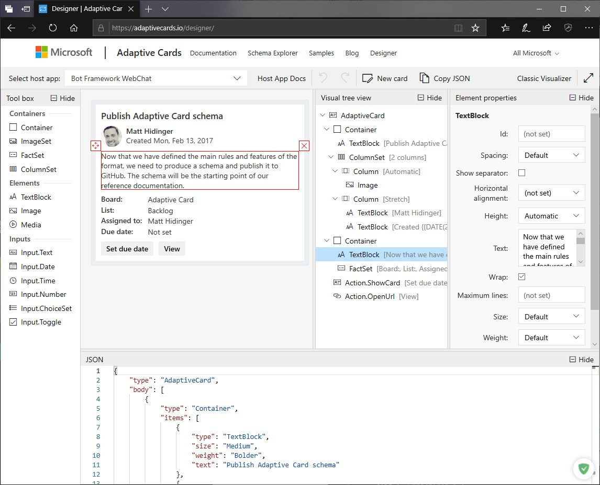

# Tools and Samples

## Card Designer 

Need for a tool to design your cards? Look no further than the browser-based adaptive card designer at [https://adaptivecards.io/designer](https://adaptivecards.io/designer)

[](https://adaptivecards.io/designer)

### Embed the designer into your app

But why send your users there when you can **embed the card designer directly into your web** app using our JavaScript library. 

Check out the [adaptivecards-designer](https://npmjs.com/adaptivecards-designer) package to get started.

## Schema validation

Schema validation is a powerful way of making authoring easier and enabling tooling.

We have provided a complete [JSON Schema file](http://adaptivecards.io/schemas/adaptive-card.json) for editing and validating 
adaptive cards in json.

In Visual Studio and Visual Studio Code you can get automatic Intellisense by including a `$schema` reference.


## Example

```json
{
    "$schema": "http://adaptivecards.io/schemas/adaptive-card.json",
    "type": "AdaptiveCard",
    "version": "1.0",
    "body": []
}
```

## Visual Studio Code Extension

We have created a Visual Studio code extension which allows you to visualize the card you are editing in real time
inside the editor itself. 


To install, open Extensions Marketplace and search for **Adaptive Card Viewer**.


### Usage

When you are editing a .json file with an Adaptive Card `$schema` property you can view by using `Ctrl+Shift+V A`.
```json
{
    "$schema": "http://adaptivecards.io/schemas/adaptive-card.json",
    "type": "AdaptiveCard",
    "version": "1.0",
    "body": []
}
```

### Options

The following Visual Studio Code setting is available for the AdaptiveCards Viewer. This can be set in User Settings or Workspace Settings.

```js
{
    // Open or not open the preview screen automatically
    "adaptivecardsviewer.enableautopreview": true,
}
```

## WPF Visualizer Sample

The [WPF visualizer sample project](https://github.com/Microsoft/AdaptiveCards/tree/master/source/dotnet/Samples/WPFVisualizer) lets you visualize cards using WPF/Xaml on a Windows machine.  A `hostconfig`
editor is built in for editing and viewing host config settings. Save these settings as a JSON to use them in rendering
in your application.


## WPF ImageRender Sample

The [ImageRender sample project](https://github.com/Microsoft/AdaptiveCards/tree/master/source/dotnet/Samples/AdaptiveCards.Sample.ImageRender) turns any card into a PNG from the command line using WPF. 
