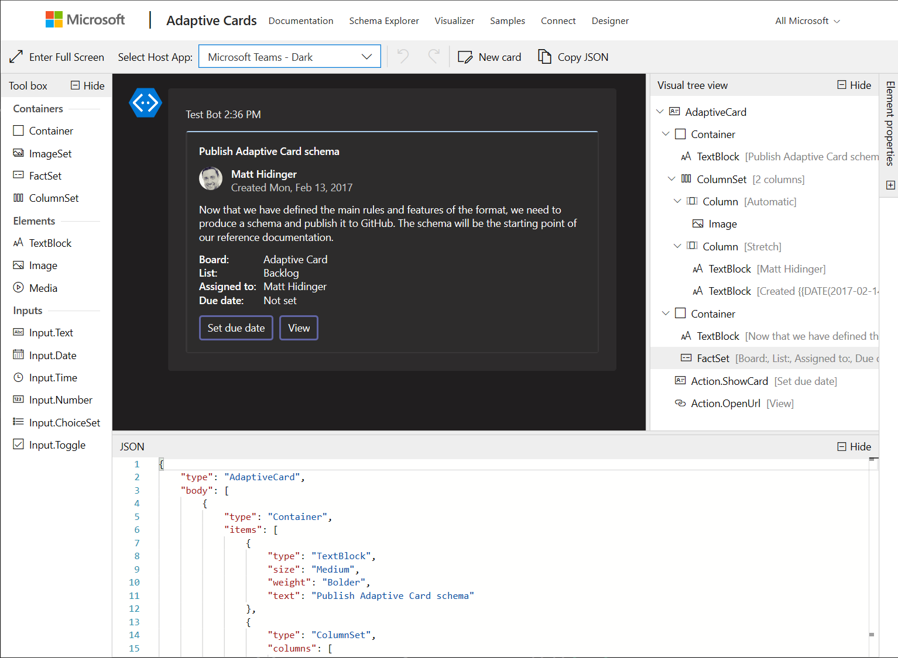

# Adaptive Cards Designer SDK

The Adaptive Card Designer provides a rich, interactive design-time experience for authoring adaptive cards.

Try it out at [https://adaptivecards.microsoft.com/designer](https://adaptivecards.microsoft.com/designer))



This SDK allows you to easily integrate the adaptive cards designer into your own experiences.

## Get Started

### Node

```console
npm install adaptivecards-designer
```

### CDN

```html
<script src="https://unpkg.com/adaptivecards-designer/dist/adaptivecards-designer.js"></script>
```

## Documentation 

Read the [full documentation](https://www.npmjs.com/package/adaptivecards-designer) on npm
