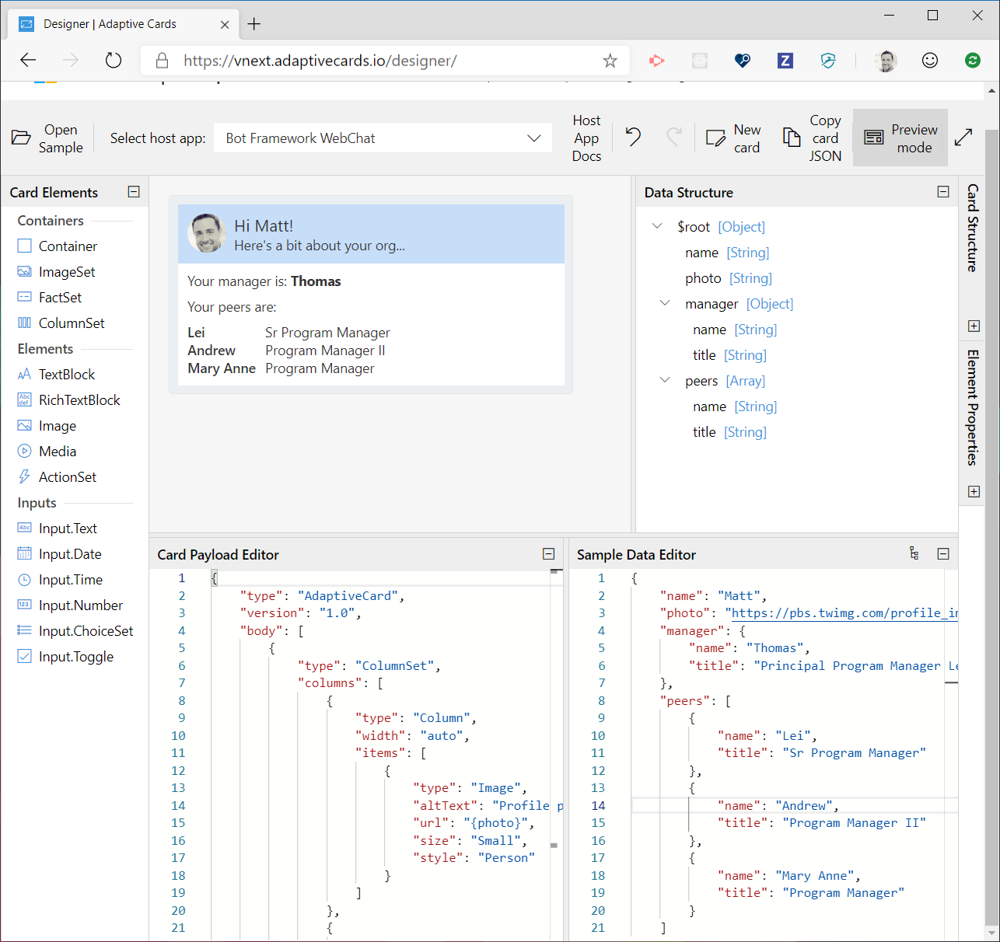

# Adaptive Cards Templating

We're excited to share a preview of new tools that will help you **create**, **reuse**, and **share** Adaptive Cards. 

> [!IMPORTANT] 
> 
> **Breaking changes** in the **May 2020 Release Candidate**
>
> The templating release candidate includes some minor breaking changes that you should be aware of if you've been using the older packages. See below for details.


## Breaking changes as of May 2020

1. The binding syntax changed from `{...}` to `${...}`. 
    * For Example: `"text": "Hello {name}"` becomes `"text": "Hello ${name}"`
2. The JavaScript API no longer contains an `EvaluationContext` object. Simply pass your data to the `expand` function. Please see the [SDK page](sdk.md) for full details.
3. The .NET API was redesigned to more closely match the JavaScript API. Please see the [SDK page](sdk.md) for full details.

## How can templating help you

Templating enables the separation of **data** from the **layout** in an Adaptive Card. 

### It helps design a card once, and then populate it with real data

Today it's impossible to create a card using the [Adaptive Card Designer](https://adaptivecards.io/designer) and use that JSON to populate the payload with **dynamic content**. In order to achieve this you must write custom code to build a JSON string, or use the Object Model SDKs to build an OM representing your card and serialize it to JSON. In either case the Designer is a one-time one-way operation and doesn't make it easy to tweak the card design later once you've converted it to code.

### It makes transmissions over the wire smaller

Imagine a world where a template and data can be combined **directly on the client**. This means if you use the same template multiple times, or want to update it with new data, you just need to send new data to the device and it can re-use the same template over and over.

### It helps you create a great looking card from just the data you provide

We think Adaptive Cards are great, but what if you didn't have to write an Adaptive Card for everything you want to display to a user? With a template service (described below) we can create a world where everyone can contribute, discover, and share templates over any type of data. 

Share within your own projects, your organization, or with the entire internet.

### AI and other services could improve user experiences

By separating data from content it opens a door for AI and other services to  "reason" over the data in the cards we see and enhance user productivity or help us find things.

## What is Adaptive Cards Templating?

It's comprised of 3 major components:

1. The **[Template Language](language.md)** is the syntax used for authoring a template. The Designer even lets you preview your templates at design time by including "sample data".
2. The **[Templating SDK's](sdk.md)** will exist on all supported Adaptive Card platforms. These SDKs allow you to populate a template with real data, on the back-end or directly on the client. 
3. The **[Template Service](service.md)** is a proof-of-concept service that allows anyone to find, contribute to, and share a set of well-known templates.

## Template Language

The template language is the syntax used to author an Adaptive Card template. 

> [!NOTE]
> 
> Follow along with the example below by opening up a new tab to
>
> **https://adaptivecards.io/designer**
> 
> Click the **Preview Mode** button to toggle between design-mode and preview-mode.



The newly updated Designer adds support for authoring templates and providing **Sample Data** to preview the card at design-time.

Paste the example below into the **Card Payload Editor** pane: 

**EmployeeCardTemplate.json**

```json
{
    "type": "AdaptiveCard",
    "version": "1.0",
    "body": [
        {
            "type": "ColumnSet",
            "style": "accent",
            "bleed": true,
            "columns": [
                {
                    "type": "Column",
                    "width": "auto",
                    "items": [
                        {
                            "type": "Image",
                            "url": "${photo}",
                            "altText": "Profile picture",
                            "size": "Small",
                            "style": "Person"
                        }
                    ]
                },
                {
                    "type": "Column",
                    "width": "stretch",
                    "items": [
                        {
                            "type": "TextBlock",
                            "text": "Hi ${name}!",
                            "size": "Medium"
                        },
                        {
                            "type": "TextBlock",
                            "text": "Here's a bit about your org...",
                            "spacing": "None"
                        }
                    ]
                }
            ]
        },
        {
            "type": "TextBlock",
            "text": "Your manager is: **${manager.name}**"
        },
        {
            "type": "TextBlock",
            "text": "Your peers are:"
        },
        {
            "type": "FactSet",
            "facts": [
                {
                    "$data": "${peers}",
                    "title": "${name}",
                    "value": "${title}"
                }
            ]
        }
    ]
}
```

Then paste the JSON data below into the **Sample Data Editor**. 

**Sample Data** helps you see exactly how your card will appear at runtime when passed actual data.

**EmployeeData**

```json
{
    "name": "Matt",
    "photo": "https://pbs.twimg.com/profile_images/3647943215/d7f12830b3c17a5a9e4afcc370e3a37e_400x400.jpeg",
    "manager": {
        "name": "Thomas",
        "title": "PM Lead"
    },
    "peers": [
        {
            "name": "Lei",
            "title": "Sr Program Manager"
        },
        {
            "name": "Andrew",
            "title": "Program Manager II"
        },
        {
            "name": "Mary Anne",
            "title": "Program Manager"
        }
    ]
}
```

Click the **Preview Mode** button. You should see the card render according to the sample data provided above. Feel free to make tweaks to the sample data and watch the card update in realtime.

**Congratulations**, you just authored your first Adaptive Card Template! Next let's learn how to populate the template with real data.

> Learn more about the [template language](language.md)

## SDK support

The Templating SDKs make it possible to populate a template with real-data.

> [!NOTE]
>
> At this time templating SDKs are available for .NET and NodeJS. Over time we will release templating SDKs for all remaining Adaptive Cards platform, like iOS, Android, UWP, etc.

Platform | Package | Install | Documentation
--- | --- | --- | ---
JavaScript | [](https://www.npmjs.com/package/adaptivecards-templating) | `npm install adaptivecards-templating` | [Documentation](https://www.npmjs.com/package/adaptivecards-templating)
.NET | [](https://www.nuget.org/packages/AdaptiveCards.Templating) | `dotnet add package AdaptiveCards.Templating` | [Documentation](https://docs.microsoft.com/adaptive-cards/templating/sdk#net)

### JavaScript Example

The JavaScript below shows the general pattern that will be used to populate a template with data.

```js
var template = new ACData.Template({ 
    // EmployeeCardTemplate goes here
});

var card = template.expand({
    $root: {
        // Your data goes here
    }
});
// Now you have an AdaptiveCard ready to render!
```

> Learn more about the [templating SDKs](sdk.md)

## Template Service

The Adaptive Cards Template Service is a proof-of-concept service that allows anyone to find, contribute to, and share a set of well-known templates.

It's useful if you want to display some data but don't want to bother writing a custom Adaptive Card for it.

The API to get a template is straight-forward enough, but the service actually offers much more, including the ability to analyze your data and find a template that might work for you.

`HTTP GET https://templates.adaptivecards.io/graph.microsoft.com/Profile.json`

All templates are flat JSON files stored in a GitHub repo so anyone can contribute to them like any other open source code.

> Learn more about the [card template Service](service.md)

## What's next and sending feedback

Templating and the separation of presentation from data takes us a whole lot closer toward our mission: "an ecosystem standardized content exchange between apps and services". We've got plenty to deliver in this area, so stay tuned and let us know how it's working for you on [GitHub](https://github.com/Microsoft/AdaptiveCards/issues)!
