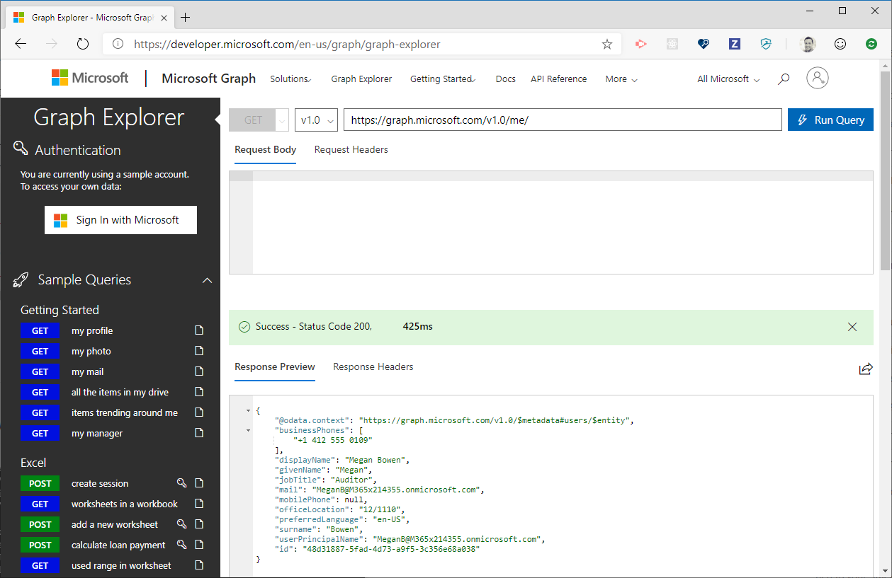

# Adaptive Cards Template Service

The Adaptive Cards Template Service is a proof-of-concept service that allows anyone to find, contribute to, and share a set of well-known templates.

It's useful if you want to display some data but don't want to bother writing a custom adaptive card for it.

> Please read this for an [overview of Adaptive Card Templating](index.md)

> [!IMPORTANT] 
> 
> *Terms and agreement* 
> 
> This **alpha-level** service is provided "as-is", with all faults and is not supported in any way. Any data collection from the service is subject to the [Microsoft privacy statement](https://go.microsoft.com/fwlink/?LinkID=824704).
> 
> These features are **in preview and subject to change**. Your feedback is not only welcome, but  critical to ensure we deliver the features **you** need.

## How does the service help me?

Let's say I just got a piece of data, maybe it's financial data, Microsoft Graph data, schema.org data, or custom data from within my organization. 

Now I want to display the data to a user. 

Traditionally that means writing custom UI code in all of the front-end stacks that I deliver to end-users.

But what if there were a world where my app could "learn" new UI templates based on the type of data? A world where anyone could contribute, enhance, and share common UI templates, within their own projects, within an organization, or for the entire internet.

## What is the card template service?

The card template service is a simple REST endpoint that helps:

* **Find** a template by analyzing the structure of your data
* **Get** a template so you can bind it directly on the client, *without sending your data to the server or ever leaving the device*
* **Populate** a template on the server, when client-side data binding isn't appropriate or possible

Behind it all, is:

* A shared, open-source template repository backed by GitHub. *(The repo is currently private but will be made public as soon as we tie up some loose ends)*
* All the templates are flat JSON files in the repo, which makes editing, contributing, and sharing a natural part of a developer workflow.
* The code for the service will be made available so you can host wherever makes the most sense to you. 

## Using the service

### Get all templates 

This endpoint returns a list of all known templates.

> `HTTP GET https://templates.adaptivecards.io/list`

**Response excerpt**

```json
{
  "graph.microsoft.com": {
    "templates": [
      {
        "file": "Files.json",
        "fullPath": "graph.microsoft.com/Files.json"
      },
      {
        "file": "Profile.json",
        "fullPath": "graph.microsoft.com/Profile.json"
      }
   ]
}
```

### Find a template

This endpoint tries to find a template by analyzing the structure of your data.

> `HTTP POST https://templates.adaptivecards.io/find`

#### Example

Let's say I access a [Microsoft Graph](https://graph.microsoft.com) endpoint to get organizational data about me.

> `HTTP GET https://graph.microsoft.com/v1.0/me/`



That API returned **JSON data**, but how do I **display it** to users using Adaptive Cards? 

First I want to see if a template exists for this type of data, so I make an HTTP request to the `/find` endpoint with my data in the `POST body`.

```
HTTP POST https://templates.adaptivecards.io/find

{
    "@odata.context": "https://graph.microsoft.com/v1.0/$metadata#users/$entity",
    "businessPhones": [
        "+1 412 555 0109"
    ],
    "displayName": "Megan Bowen",
    "givenName": "Megan",
    "jobTitle": "Auditor",
    "mail": "MeganB@M365x214355.onmicrosoft.com",
    "mobilePhone": null,
    "officeLocation": "12/1110",
    "preferredLanguage": "en-US",
    "surname": "Bowen",
    "userPrincipalName": "MeganB@M365x214355.onmicrosoft.com",
    "id": "48d31887-5fad-4d73-a9f5-3c356e68a038"
}
```

**Response:**

```json
[
  {
    "templateUrl": "graph.microsoft.com/Profile.json",
    "confidence": 1
  }
]
```

The service returns a list of any matching templates, along with a `confidence` indicating how close the match is. Now I can use that template URL to **get** the template, or **populate** it server-side.

### Get a template

A template retrieved from this endpoint can be populated with data at runtime [using the templatng SDKs](sdk.md).

> `HTTP GET https://templates.adaptivecards.io/[TEMPLATE-PATH]`

You can also include "sample data" with the template, which makes editing in the designer more friendly:

> `HTTP GET https://templates.adaptivecards.io/[TEMPLATE-PATH]?sampleData=true`

#### Example

Let's get the Microsoft Graph profile template that was returned from `/find` above.

`HTTP GET https://templates.adaptivecards.io/graph.microsoft.com/Profile.json`

**Response excerpt**

```json
{
  "type": "AdaptiveCard",
  "version": "1.0",
  "body": [
    {
      "type": "TextBlock",
      "size": "Medium",
      "weight": "Bolder",
      "text": "{name}"
    },
    {
        // ...snip
    }
  ]
}
```

Now use this template with the [templating SDKs](sdk.md) to create a ready-to-render Adaptive Card.

### Populate a template server-side

In some cases it may not make sense to populate a template on the client.  For these use cases, you can have the service return a fully-populated Adaptive Card, ready to be passed to any Adaptive Card Renderer.

> `HTTP POST https://templates.adaptivecards.io/[TEMPLATE-PATH]`

#### Example

Let's populate the Microsoft Graph profile template that was returned from `/find` using the data above.

```
HTTP POST https://templates.adaptivecards.io/graph.microsoft.com/Profile.json

{
    "@odata.context": "https://graph.microsoft.com/v1.0/$metadata#users/$entity",
    "businessPhones": [
        "+1 412 555 0109"
    ],
    "displayName": "Megan Bowen",
    "givenName": "Megan",
    "jobTitle": "Auditor",
    "mail": "MeganB@M365x214355.onmicrosoft.com",
    "mobilePhone": null,
    "officeLocation": "12/1110",
    "preferredLanguage": "en-US",
    "surname": "Bowen",
    "userPrincipalName": "MeganB@M365x214355.onmicrosoft.com",
    "id": "48d31887-5fad-4d73-a9f5-3c356e68a038"
}
```

**Response excerpt**

```json
{
  "type": "AdaptiveCard",
  "version": "1.0",
  "body": [
    {
      "type": "TextBlock",
      "size": "Medium",
      "weight": "Bolder",
      "text": "Megan Bowen"
    },
    {
        // ...snip
    }
  ]
}
```

Notice how the response replaced the text of the first `TextBlock` with `"Megan Bowen"` instead of `"{name}"`, as in the `GET` request. This AdaptiveCard can now be passed to any Adaptive Card renderer without going through client-side templating.

## Contributing templates

The templates are hosted on GitHub in the [adaptivecards-templates](https://github.com/microsoft/adaptivecards-templates) repo.

Our hope is that by using GitHub as a backing store for the templates, we can "democratize" the process of authoring, enhancing, and sharing templates. Anyone can submit a Pull Request that includes an entirely new template, or make enhancements to existing ones... all within the developer-friendly experience of GitHub.

## Self-hosting the service

Not all types of data are appropriate for the "central" Adaptive Cards template service hosted at `https://templates.adaptivecards.io`. 

We want to make sure anyone can host the template service within your organization, so the source code is available on GitHub and can be easily deployed to your own Azure Function. 

Get started here ➡ [adaptivecards-templates](https://github.com/microsoft/adaptivecards-templates)
